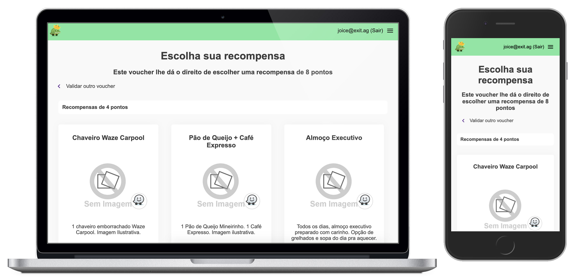
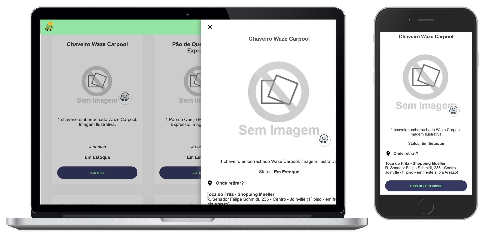
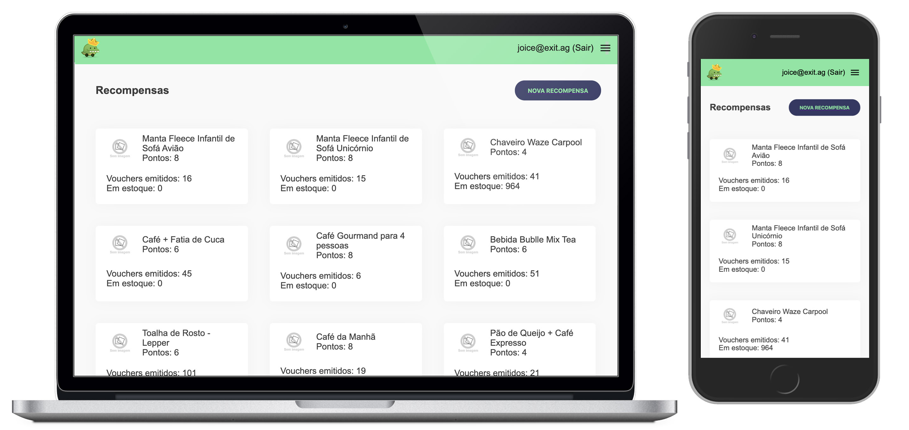
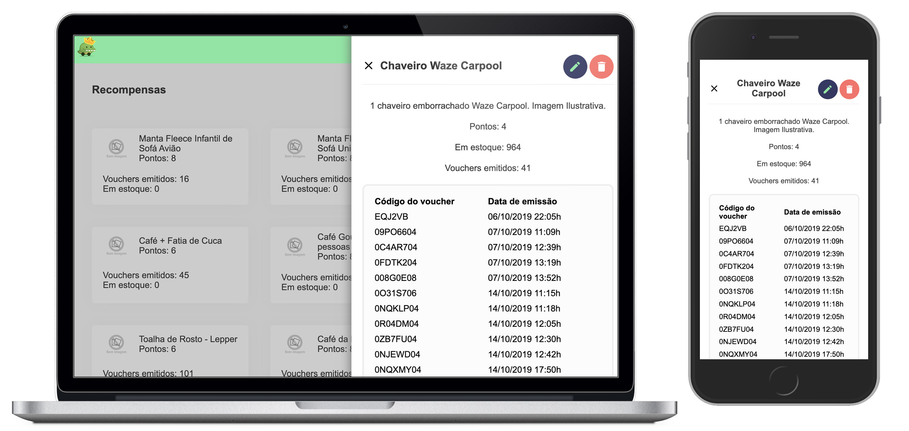
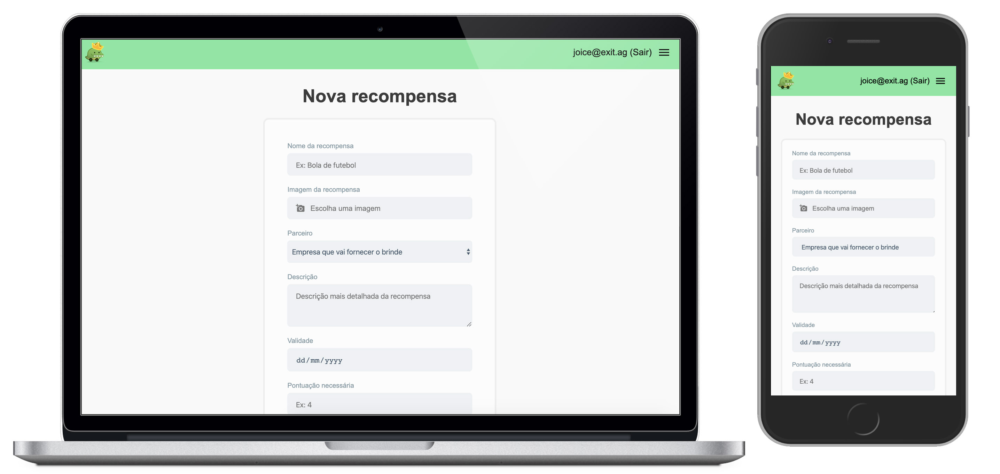

This project, lead by the Waze Carpool team, was aimed to create a rewards exchange system, as part of the client's marketing effort on a campaign that took place in Joinville - SC - Brazil.

The user was first sent a voucher code on his Waze CarPool App from a collection of vouchers that were previously generated by the system.

With his voucher in hands, he had to go to a <a target="_blank" href="http://seguetodavidajunto.com.br/">landing page</a> - not created by me, but but the end result was extremely good - that would explain all the mechanincs of the promotion.

Finally, he would then proceed to access te rewards system, and exchange his voucher for any of the rewards available, provided that he had enough points for the desired reward.

**This project was delivered in 2 weeks**

The <a href="http://waze-voucher.herokuapp.com/" target="_blank">system is online and you can check it here</a>.
Also, you can check some of the system screens below:

## Tech Stack

- **For the backend**: `node`, `express`, `graphql`, hosted by `heroku`.
- **For the frontend**: `react`, `redux`, `graphql`, hosted by `heroku`.
